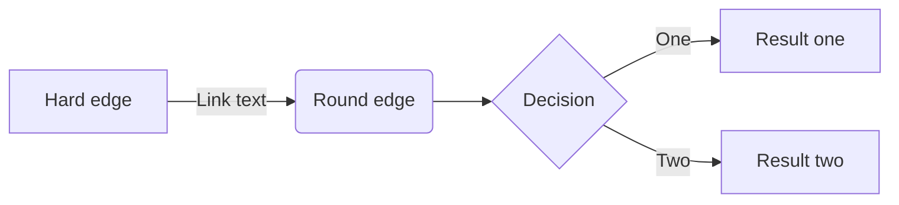
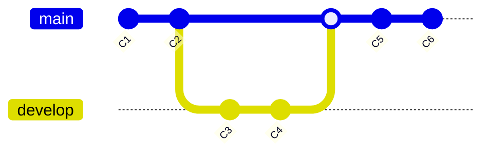

## Mathematical Equations

This style has KaTeX enabled, allowing for writing mathematical expressions in LaTeX math notation.

### Using Block Syntax

Blocks must be enclosed in `$$...$$` or `\[...\]` on separate lines:

```text title="block syntax"
$$
V_{LJ}(r)=\frac{C12}{r^{12}}-\frac{C6}{r^{6}}
$$
```
$$
V_{LJ}(r)=\frac{C12}{r^{12}}-\frac{C6}{r^{6}}
$$

### Using inline block syntax 

Inline blocks must be enclosed in $...$ or \(...\):

```text title="block syntax"
The Pythagorean theorem $a^2+b^2=c^2$ can be rearranged to $ c = \sqrt{a^2 + b^2} $
```

The Pythagorean theorem $a^2+b^2=c^2$ can be rearranged to $ c = \sqrt{a^2 + b^2} $

### Example

The simplest way to write the time-independent Schrödinger equation is $H\psi = E\psi$, 
however, with the Hamiltonian operator expanded it becomes:

$$
-\frac{\hbar^2}{2m} \frac{d^2 \psi}{dx^2} + V\psi = E\psi\\
$$


## Mermaid Diagrams

[Mermaid](https://mermaid-js.github.io/mermaid/#/) is a JavaScript library that can be used
to write various graphs and flow-charts within Markdown and render them on a website. 
This template has Mermaid support enabled and can be used as shown below.

### Flowchart

[Documentation for Mermaid Flowchart](https://mermaid-js.github.io/mermaid/#/flowchart)

```text
 ``` mermaid
 graph LR
    A[Hard edge] -->|Link text| B(Round edge)
    B --> C{Decision}
    C -->|One| D[Result one]
    C -->|Two| E[Result two]
 ```
```



### Git Graph

[Documentation for Mermaid gitGraph](https://mermaid-js.github.io/mermaid/#/gitgraph)

```
 ``` mermaid
 gitGraph
   commit id: "C1"
   commit id: "C2"
   branch develop
   checkout develop
   commit id: "C3"
   commit id: "C4"
   checkout main
   merge develop
   commit id: "C5"
   commit id: "C6"
 ```
```




## Instructor View

Some lessons are rather complex and require a lot of information, which can result in long blocks
of text that are needed for self-study as well as new instructors that need to familiarize
themselves with the material.  
In a workshop or presentation setting however it's difficult to pick out the talking points and
having key information in bullet-points would be much better.

A solution to this is to introduce an "Instructor View" that will hide paragraphs that have been 
marked as `/// html | div[class="learner"]` and instead show paragraphs marked as `/// html | div[class="instructor"]`, which are otherwise hidden.  

The instructor view can be enabled in the `mkdocs.yml` file with:

```yaml
instructor_view_enable: true
```

If enabled, one the following toggle icons will appear in the Navigation bar at the top 
to indicate which view is active and to toggle between them:

* Learner view active: :material-account-school:
* Instructor view is active: :material-human-male-board:

The state of the toggle is persistent for some time (by default 7 days) by setting a cookie, 
however this duration can be customized by a variable in `mkdocs.yml`:

```yaml
instructor_view_cookie_lifetime: 3
```

**Example**:

````text
/// html | div[class="learner"]
This is a long text that describes a complex topic in detail. 
This contains information that the instructor explains in detail.   
_Lorem ipsum dolor sit amet,[...] sunt in culpa qui officia deserunt mollit anim id est laborum._
///

/// html | div[class="instructor"]
* talking points for instructor
* easier to read during the workshop
///
````

Will be shown as:

/// html | div[class="learner"]
This is a long text that describes a complex topic in detail.
This contains information that the instructor explains in detail.   
_Lorem ipsum dolor sit amet,[...] sunt in culpa qui officia deserunt mollit anim id est laborum._
///

/// html | div[class="instructor"]
* talking points for instructor
* easier to read during the workshop
///


## Custom code blocks

```{.text .leap}
s = loadpdb protein.pdb
set {s.20 s.26} name "ASH"
savepdb s protonated.pdb
quit
```

```{.text .cpptraj}
trajin mdcrd_nowat.nc
trajout mdcrd_nowat.xtc
go
```

```{.tcl .vmd}
cd ~/scratch/workshop/pdb/6N4O/simulation/sim_pmemd/4-production
mol new prmtop_nowat.parm7
mol addfile mdcrd_nowat.xtc step 5
```

```{.tcl .file title="~/.vmdrc"}
# VMD settings: file ~/.vmdrc

# Turning-on of menus
menu main on

# Change display defaults
display reposition 100 600
display resize 672 682
display projection Orthographic
display depthcue off
display rendermode GLSL
display ambientocclusion on
axes location Off
color Display Background white

# Default material
mol default material Diffuse

# Configure keyboard shortcuts
user add key o {display projection orthographic} 
user add key p {display projection perspective}
```